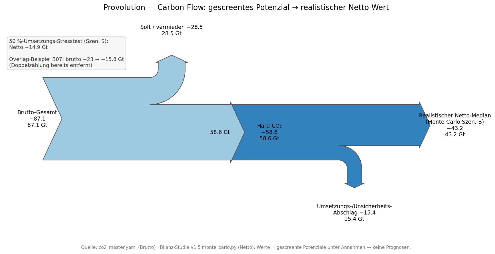

# Carbon-Flow-Sankey — gescreentes Potenzial → realistischer Netto-Wert

**Stand:** 2026-05-30 · **Charakter:** Reviewer-Supplement (Hälfte 2 von Punkt 4) · **Companion zu:** [`canon/STATUS.md`](../../canon/STATUS.md) §2, [`canon/LIMITATIONS.md`](../../canon/LIMITATIONS.md) #2/#16

Visualisiert für Reviewer-Q4 (Double-Counting / „−58,6 Gt = Überclaiming?"), dass die Headline-Potenziale **gescreente Ceilings, keine Prognosen** sind — und wo die Reduktion zwischen Brutto-Potenzial und realistischem Netto-Median liegt.



## Was die Figur zeigt

- **Brutto-Gesamt −87,1 Gt** spaltet in **Hard-CO₂ −58,6** (Schicht 1, direkt) + **Soft/vermieden −28,5** (Schicht 2, vermiedene Emissionen).
- **Hard-CO₂ −58,6** spaltet in den **realistischen Netto-Median −43,2** (Monte-Carlo Szen. B) + **Umsetzungs-/Unsicherheits-Abschlag −15,4**.
- **Annotation:** 50 %-Umsetzungs-Stresstest (Szen. S) → Netto **−14,9**; Overlap-Beispiel **B07 brutto −23 → −15,8** (Doppelzählung bereits in den Domain-Totalen entfernt).

**Kernbotschaft:** Die −58,6/−87,1 sind Potenzial-Obergrenzen unter Annahmen; der **kommunizierbare realistische Wert ist der Monte-Carlo-Median −43,2 Gt** (bzw. −14,9 im Stresstest). Overlaps sind bereits bereinigt — kein Double-Counting auf Domain-Ebene.

## Reproduktion

```
python studies/CARBON_FLOW_2026-05-30/build_carbon_flow_sankey.py
```

Brutto-Werte (−87,1 / −58,6 / −28,5) werden **live aus `canon/data/co2_master.yaml`** gelesen; die Monte-Carlo-Netto-Werte (−43,2 / −14,9) stammen als dokumentierte Konstante aus der Bilanz-Studie (`studies/CO2_BILANZ_2026-05-28/`, `monte_carlo.py`). Output: `carbon_flow_sankey.png` + `.svg`.

## Grenzen

- Aggregat-Darstellung (Domain-/Schicht-Ebene), nicht hebel-granular.
- Die **Inter-Domain-Rückkopplung** (dekarbonisiert C den Strom → ändert sich die B-Materialvorkette?) ist **nicht** modelliert (offener Punkt, LIMITATIONS #16).
- Monte-Carlo-Werte als Konstante eingebettet (Quelle zitiert); bei Re-Run der Bilanz aktualisieren.

---

*Companion: [`canon/STATUS.md`](../../canon/STATUS.md) · [`studies/CONSISTENCY_MATRIX_2026-05-30/`](../CONSISTENCY_MATRIX_2026-05-30/CONSISTENCY_MATRIX_REPORT.md) (Hälfte 1 von Punkt 4) · [`studies/CO2_BILANZ_2026-05-28/`](../CO2_BILANZ_2026-05-28/CO2_BILANZ_KOMPLETT.md).*
